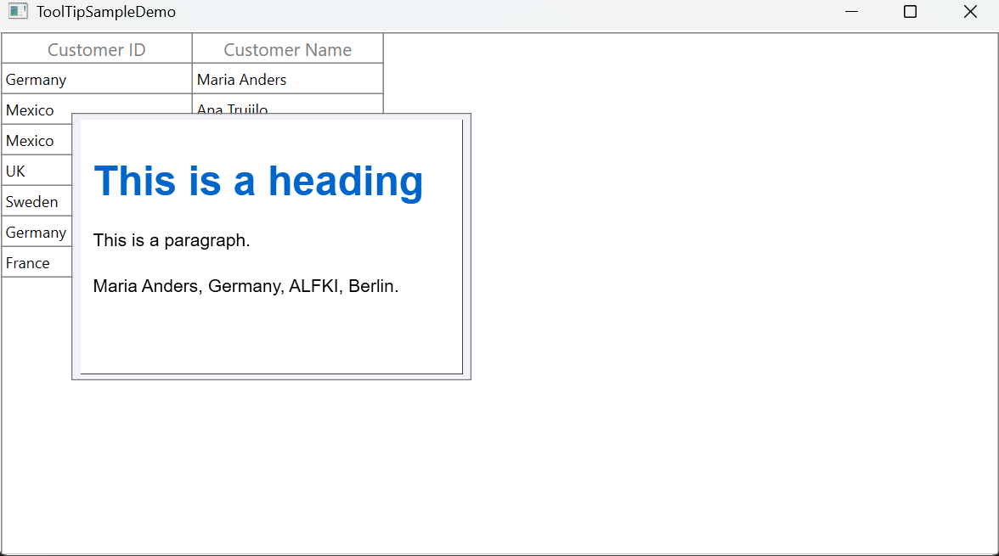

# How to show the rendered HTML inside the ToolTip of the WPF SfDataGrid

By default, [SfDataGrid](https://www.syncfusion.com/wpf-controls/datagrid) does not have built-in support to render HTML code and display it in the **tooltip**. However, we can achieve this requirement by rendering the **HTML** using [SfRichTextBoxAdv](https://www.syncfusion.com/wpf-controls/richtextbox)

In this approach, load the HTML code into **SfRichTextBoxAdv**, render the HTML content, and then set SfRichTextBoxAdv as the tooltip content inside the [CellToolTipOpening](https://help.syncfusion.com/cr/wpf/Syncfusion.UI.Xaml.Grid.SfDataGrid.html#Syncfusion_UI_Xaml_Grid_SfDataGrid_CellToolTipOpening) event.

**Step 1: Subscribe to the CellToolTipOpening Event of the SfDataGrid**
                         
Subscribe to the CellToolTipOpening event of SfDataGrid, and enable the [ShowTooltip](https://help.syncfusion.com/cr/wpf/Syncfusion.UI.Xaml.Grid.SfGridBase.html#Syncfusion_UI_Xaml_Grid_SfGridBase_ShowToolTip) property for the desired column where the tooltip should be displayed.

 ```xml
<syncfusion:SfDataGrid HorizontalAlignment="Center"  
                        x:Name="dataGrid"  
                        ItemsSource="{Binding Orders}" 
                        AutoGenerateColumns="False" 
                        CellToolTipOpening="OnCellToolTipOpening">
    <syncfusion:SfDataGrid.Columns>
          <syncfusion:GridTextColumn HeaderText="Customer ID" 
                                     MappingName="CustomerID" 
                                     ShowToolTip="True"/>
        <syncfusion:GridTextColumn HeaderText="Customer Name" 
                                   MappingName="CustomerName"/>
    </syncfusion:SfDataGrid.Columns>
</syncfusion:SfDataGrid> 
 ```
**Step 2: Customize the ToolTip content to display as HTML content**
           
   In the event handler, retrieve the HTML code, convert it into a stream, and pass it to RichTextBoxAdv. Then, set RichTextBoxAdv as the tooltip content of the SfDataGrid.

 ```csharp
    SfRichTextBoxAdv richTextBoxAdv = new SfRichTextBoxAdv() { Width = 300, Height = 200, LayoutType = LayoutType.Continuous};

    private void OnCellToolTipOpening(object sender, GridCellToolTipOpeningEventArgs e)
    {
       if (e.Record != null && e.Record is OrderInfo)
       {
           string htmlContent = (e.Record as OrderInfo).HTMLCode;
           if (htmlContent != null)
           {
              Stream stream = new MemoryStream();
              byte[] bytes = Encoding.UTF8.GetBytes(htmlContent);
              if (bytes != null)
                 stream.Write(bytes, 0, bytes.Length);
              stream.Position = 0;
              richTextBoxAdv.Load(stream, FormatType.Html);
              e.ToolTip.Content = richTextBoxAdv;
           }      
        }
     }
 ```

 

Take a moment to peruse the [WPF SfDataGrid - ToolTip](https://help.syncfusion.com/wpf/datagrid/tooltip) documentation where you can find about the tooltip with code examples.